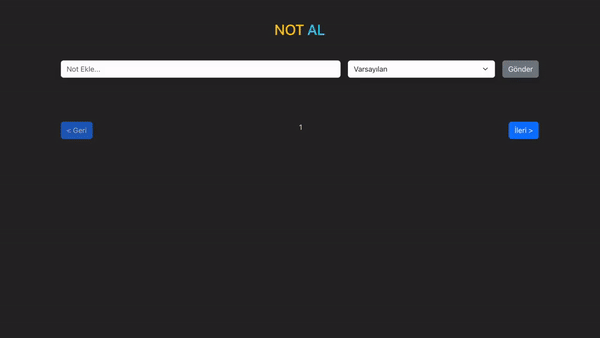

# Not Alma Uygulaması

Bu proje, basit bir not alma uygulamasını içermektedir. Kullanıcılar, uygulama üzerinden not ekleyebilir, düzenleyebilir ve silebilirler. Ayrıca, notları sayfalama özelliği ile listeleyebilirler.

## Teknolojiler

- **React:** Kullanıcı arayüzü için React kütüphanesi kullanılmıştır.
- **Axios:** HTTP istekleri için Axios kütüphanesi kullanılmıştır.
- **Bootstrap:** Temel stil ve düzen için Bootstrap kullanılmıştır.
- **JSON Server:** Proje için basit bir API sağlamak amacıyla JSON Server kullanılmıştır.

## Proje Yapısı

- **components/Form:** Not ekleme formu bileşeni.
- **components/Loader:** Yükleniyor durumu için loader bileşeni.
- **components/ListItem:** Notları listeleyen bileşen.
- **App.js:** Ana uygulama bileşeni. Notları yönetir ve sayfalama işlemlerini gerçekleştirir.
- **db.json:** JSON Server'ın kullanımı için temel veritabanı dosyası.

## Fonksiyonlar

- **Not Ekleme:** Kullanıcılar yeni not ekleyebilir.
- **Not Listeleme:** Notlar sayfa sayfa listelenir.
- **Not Silme:** Kullanıcılar notları silebilir.
- **Zaman Aşımı Kontrolü:** Axios ile yapılan isteklerde zaman aşımına karşı kontrol eklenmiştir.

## JSON Server Kurulumu

Projede, basit bir API sağlamak için JSON Server kullanılmıştır. JSON Server'ı başlatmak için aşağıdaki adımları takip edebilirsiniz:

1. JSON Server'ı başlatın.
   ```bash
   json-server --watch db.json --port 3000
   ```

2. Proje, `http://localhost:3000` adresinde çalışacaktır.

## Kurulum

1. Projeyi bilgisayarınıza klonlayın.
   ```bash
   git clone https://github.com/avcisalih/React_Crud
   ```

2. Proje klasörüne gidin.
   ```bash
   cd React_Crud
   ```

3. Gerekli bağımlılıkları yükleyin.
   ```bash
   npm install
   ```

4. Projeyi başlatın.
   ```bash
   npm start
   ```

## Önemli Notlar

- Projede Axios kullanılarak JSON Server ile iletişim sağlanmıştır. JSON Server'ın başarıyla çalıştığından emin olunmalıdır.
- Zaman aşımı durumunda kullanıcıya bilgilendirme yapılacak şekilde önlem alınmıştır.


## Projenin Ekran Görüntüsü


